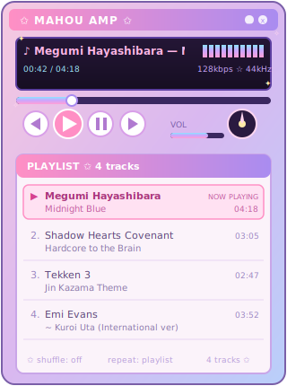

# ✩ Mahou Amp ✩

A magical-girl-themed, Winamp-inspired music player widget — pastel gradients, twinkling stars, a scrolling marquee display, and a scrollable playlist. Built as an SVG (for static display, like a GitHub README) and as a fully interactive HTML version (for actual use).



---

## What's Inside

| File | What it's for |
|---|---|
| `mahou-amp-player.svg` | A **static** image of the player. This is what renders inside GitHub READMEs, since GitHub strips out `<script>` and most interactivity from Markdown-rendered HTML. |
| `mahou_amp_player.html` | The **fully interactive** version — real play/pause state, a clickable and scrollable playlist, draggable seek and volume sliders. Open this directly in a browser, or host it (GitHub Pages, your own site, etc.) and link to it. |

**Why two files?** GitHub READMEs only render static content — images, not live JavaScript. The SVG is what shows up *inside* your README. The HTML file is the real, working player; it just can't run embedded in the README itself.

---

## Features

- Pastel gradient shell with twinkling star decorations
- Scrolling "now playing" marquee in the LCD display
- Animated 10-bar equalizer that pauses/resumes with playback
- Spinning sparkle disc that spins only while a track is "playing"
- Click-to-select playlist — selecting a track updates the display, marquee, and now-playing highlight
- **Scrollable playlist** — the playlist holds more tracks than fit on screen at once; scroll with your mouse wheel, or click-and-drag inside the playlist panel. A small pink scrollbar thumb on the right edge tracks your position.
- Draggable seek bar and volume slider
- **Real playback, real durations** — the interactive version is wired to actual YouTube videos via the YouTube IFrame Player API. Track lengths shown in the playlist are pulled live from YouTube, not typed in by hand (see [A Note on Track Durations](#a-note-on-track-durations) below for how that works).

---

## A Note on Track Durations

The static SVG (`mahou-amp-player.svg`) shows **hand-typed placeholder durations** — they're just text, not real data, since an SVG can't talk to YouTube.

The interactive version pulls **real durations from YouTube itself**, which comes with one quirk worth knowing: YouTube's player only reports a video's length *after* that specific video has been loaded at least once. Left as the simplest possible implementation, that would mean only the very first track shows a real time on page load, and the rest would show `--:--` until you'd clicked into each one — a visible downgrade from the static version, where all 9 times are just always there (even if fake).

To avoid that, the interactive version silently cues every track in the playlist once in the background the moment the player is ready — no sound, no visible playback, just enough to ask YouTube "how long is this?" — then restores whichever track you actually have selected. The practical effect: all 9 real durations populate within a second or two of the page loading, same as the static version felt, except now they're accurate instead of placeholder text.

---

## How to Embed the Static Version (e.g. in a GitHub README)

1. Add `mahou-amp-player.svg` to your repository.
2. In your `README.md`, reference it as an image:

```markdown
<p align="center">
  
</p>
```

That's it — no setup, no dependencies. It's just an image, so it works anywhere Markdown images work (READMEs, wikis, Discord embeds via a raw GitHub link, etc.).

> **Note:** because it's a static image, the playlist won't actually scroll and the buttons won't respond to clicks in this version — for that, see below.

---

## How to Use the Interactive Version

1. Download `mahou_amp_player.html`.
2. Double-click it, or drag it into a browser tab — no install, no build step.
3. Everything works immediately, with real audio playing from YouTube:
   - Click ▶ / ⏸ / ◀ / ▶▶ to control actual playback
   - Click any track in the playlist to load and play it
   - Scroll or drag inside the playlist to browse all 9 tracks
   - Drag the seek bar to jump to a real point in the video; drag the volume slider to control real volume

Playback requires an internet connection (it's loading real YouTube videos in the background) and a browser that allows the YouTube IFrame API — works in any modern desktop or mobile browser.

If you want this reachable from a link (instead of a downloaded file), host it with **GitHub Pages**:

1. In your repo settings, enable GitHub Pages (e.g. serving from `main` branch, root or `/docs`).
2. Place `mahou_amp_player.html` in the published folder.
3. Visit `https://yourusername.github.io/your-repo/mahou_amp_player.html`.
4. Link to that URL from your README:

```markdown
🎧 [Open the interactive player](https://yourusername.github.io/your-repo/mahou_amp_player.html)
```

---

## Using Your Own Tracks

### Option A: YouTube (built in by default)

The player is already wired to YouTube via the YouTube IFrame Player API. To swap in your own tracks, edit the `tracks` array near the top of the `<script>` block:

```js
var tracks = [
  {artist:"Artist Name", title:"Song Title", videoId:"VIDEO_ID_HERE"},
  // ...
];
```

The `videoId` is the part after `watch?v=` in any YouTube URL (e.g. `https://www.youtube.com/watch?v=nCgOhvZ7AaA` → `nCgOhvZ7AaA`). Durations are fetched automatically — see [A Note on Track Durations](#a-note-on-track-durations) above — so you never need to type a duration by hand.

### Option B: Your own local audio files

If you'd rather play your own hosted `.mp3`/`.wav` files instead of YouTube, swap the YouTube wiring for a plain HTML5 `<audio>` element:

```html
<audio id="audioEl" preload="auto"></audio>
```

```js
var audioEl = document.getElementById('audioEl');

document.getElementById('btnPlay').addEventListener('click', function(){
  audioEl.play(); playing = true; updateAll();
});
document.getElementById('btnPause').addEventListener('click', function(){
  audioEl.pause(); playing = false; updateAll();
});

function loadTrack(i){
  current = i;
  audioEl.src = tracks[i].file; // e.g. "songs/midnight-blue.mp3"
  audioEl.play();
  playing = true;
  updateAll();
}

audioEl.addEventListener('timeupdate', function(){
  var pct = audioEl.currentTime / audioEl.duration;
  setSeek(18 + pct * (302 - 18));
});
audioEl.addEventListener('ended', function(){
  document.getElementById('btnNext').click();
});
audioEl.addEventListener('loadedmetadata', function(){
  durationCache[current] = fmtTime(audioEl.duration);
  renderPlaylist();
});
```

A few practical notes if you go this route:

- You'll need to **host your own audio files** — this project doesn't include or distribute any actual song files. Make sure you have the rights to use whatever audio you add (your own recordings, royalty-free tracks, or music you're licensed to use).
- For volume, set `audioEl.volume = clamped / 100` inside the existing `setVol()` function.
- The equalizer bars and spinning disc are just CSS animations tied to a `playing` boolean — they don't analyze real audio frequency data. For a true audio-reactive equalizer, look into the Web Audio API's `AnalyserNode`.

### Option C: SoundCloud

SoundCloud has its own Widget JS API with a similar shape to YouTube's (play/pause/seek/events), so the same general pattern used for YouTube can be adapted to SoundCloud track URLs. Not wired in by default in this build, but straightforward to add if needed.

### A note on Spotify

Spotify is the odd one out. Getting the same level of custom control shown here (play/pause/seek driven by *your own* buttons) requires the Spotify **Web Playback SDK**, which needs a Spotify Premium account and an OAuth login flow — it can't play from a plain public link the way YouTube/SoundCloud can. The simpler alternative (`open.spotify.com/embed/track/...`) gives you Spotify's own stock player UI in an iframe, but that UI is Spotify's, not this one — your custom buttons can't drive it.

---

## Customizing

- **Playlist tracks**: edit the `tracks` array near the top of the `<script>` block in `mahou_amp_player.html`. Each entry needs `artist`, `title`, and `videoId` (durations are fetched automatically — don't add them by hand).
- **Colors**: all gradients are defined once in the `<defs>` block at the top of the SVG (`#frame`, `#titlebar`, `#lcd`, `#barglow`) — change the `stop-color` values there to retheme the whole player.
- **Number of visible playlist rows**: controlled by `VIEW_H` in the script (currently `190`, enough for about 4–5 rows before scrolling kicks in).

---

## License

Personal/portfolio use — <a href="https://github.com/accordanalyst/mahouyo">Mahouyo Amp </a> © 2026 by <a href="https://github.com/accordanalyst/">Analyst Accord</a> is licensed under <a href="https://creativecommons.org/licenses/by-nc-sa/4.0/">CC BY-NC-SA 4.0</a>
